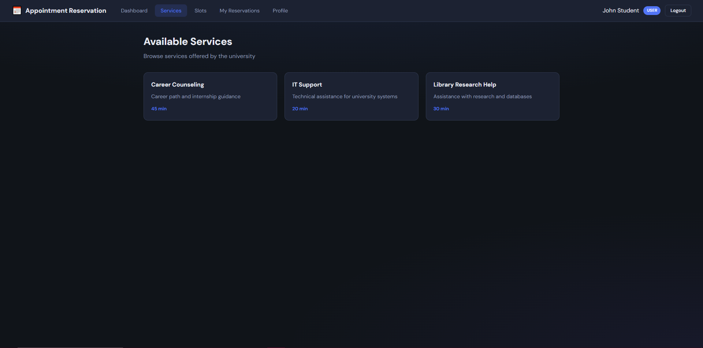

# Appointment Reservation System


A full-stack web application for appointment reservation developed as part of the **Analysis and Software Design** course.

The system allows users to browse services, view available appointment slots, create and cancel reservations, and manage their profiles. Administrators can manage services, appointment slots, reservations, and users through a dedicated administration interface.

---

## Academic Context

This project was developed as a university course project for **Analysis and Software Design (ADS)**.

The project includes complete software analysis and design documentation, UML modeling, implementation, database design, and a working software solution. The project received the highest evaluation during the course assessment.

---

## Features

### User Features

* User registration
* User authentication (JWT)
* Login and logout
* View available services
* View available appointment slots
* Create appointment reservations
* Cancel reservations
* View reservation history
* View user profile

### Administrator Features

* Create services
* Edit services
* Delete services
* Create appointment slots
* Delete appointment slots
* View all reservations
* Manage users

---

## Key Business Rules

* Users cannot reserve occupied appointment slots.
* Users cannot reserve appointment slots in the past.
* Duplicate active reservations are prevented.
* Appointment slots become unavailable after successful reservation.
* Cancelled reservations release the appointment slot.
* Protected endpoints require JWT authentication.
* Administrative actions require administrator privileges.

---

## Architecture

The project follows **Clean Architecture** principles.

Request Flow:

Frontend

↓

API Controllers

↓

Application Services

↓

Repository Interfaces

↓

Repository Implementations

↓

SQLite Database

The architecture separates business logic from infrastructure concerns, improving maintainability, scalability, and testability.

### Architecture Layers

| Layer          | Responsibility                                 |
| -------------- | ---------------------------------------------- |
| Domain         | Business entities and enums                    |
| Application    | Business rules and use cases                   |
| Infrastructure | Database access and repositories               |
| API            | Controllers, routes, middleware and validation |
| Frontend       | User interface and API communication           |

---

## Project Structure

```text
AppointmentReservationSystem/
│
├── backend/
│   ├── database/
│   │   └── schema.sql
│   │
│   ├── src/
│   │   ├── domain/
│   │   ├── application/
│   │   ├── infrastructure/
│   │   └── api/
│   │
│   ├── data/
│   ├── package.json
│   └── .env.example
│
├── frontend/
│   ├── index.html
│   ├── css/
│   └── js/
│
├── docs/
│   ├── uml/
│   ├── screenshots/
│   ├── FUNCTIONAL_REQUIREMENTS.md
│   ├── NON_FUNCTIONAL_REQUIREMENTS.md
│   ├── USE_CASES.md
│   ├── USER_STORIES.md
│   └── API_ENDPOINTS.md
│
└── README.md
```

---

## Technology Stack

### Backend

* Node.js
* Express.js
* SQLite
* better-sqlite3
* JWT (jsonwebtoken)
* bcryptjs
* express-validator

### Frontend

* HTML5
* CSS3
* JavaScript (Vanilla JS)

### Database

* SQLite

### Design & Documentation

* UML
* PlantUML
* Clean Architecture
* Repository Pattern
* Service Layer Pattern

---

## UML Documentation

The project contains complete UML documentation required for software analysis and design.

Included diagrams:

* Use Case Diagram
* Domain Model
* System Sequence Diagram
* Class Diagram
* Sequence Diagram
* Communication Diagram
* State Diagram
* Activity Diagram
* Component Diagram
* Deployment Diagram

Documentation is available in:

```text
docs/uml/
```

---

## Screenshots


### Login Screen


### Services Screen



### Reservations Screen


### Admin Panel


---

## Database Model

Main entities:

### User

* Id
* FullName
* Email
* Password
* Role

### Service

* Id
* Name
* Description
* Duration

### AppointmentSlot

* Id
* Date
* StartTime
* EndTime
* ServiceId
* IsAvailable

### Reservation

* Id
* UserId
* SlotId
* ReservationDate
* Status

---

## Installation

### Prerequisites

* Node.js 18+
* npm

### Install Dependencies

```bash
cd backend
npm install
```

---

## Environment Configuration

Create a `.env` file:

```env
PORT=3000
JWT_SECRET=your-super-secret-jwt-key
JWT_EXPIRES_IN=24h
```

Or copy the example file:

```bash
copy .env.example .env
```

Linux/macOS:

```bash
cp .env.example .env
```

---

## Database Initialization

Populate the database with sample data:

```bash
npm run seed
```

This creates:

* Demo users
* Demo services
* Demo appointment slots
* Sample reservations

---

## Running the Application

### Production Mode

```bash
npm start
```

### Development Mode

```bash
npm run dev
```

Open:

```text
http://localhost:3000
```

---

## Demo Accounts

| Role          | Email                                               | Password |
| ------------- | --------------------------------------------------- | -------- |
| Administrator | [admin@university.edu](mailto:admin@university.edu) | admin123 |
| User          | [john@university.edu](mailto:john@university.edu)   | user123  |
| User          | [jane@university.edu](mailto:jane@university.edu)   | user123  |

---

## API Overview

### Authentication

```http
POST /api/auth/register
POST /api/auth/login
POST /api/auth/logout
GET  /api/auth/me
```

### Services

```http
GET    /api/services
POST   /api/services
PUT    /api/services/:id
DELETE /api/services/:id
```

### Appointment Slots

```http
GET    /api/slots
POST   /api/slots
DELETE /api/slots/:id
```

### Reservations

```http
GET    /api/reservations
POST   /api/reservations
PUT    /api/reservations/:id/cancel
```

### Users

```http
GET    /api/users
GET    /api/users/profile
PUT    /api/users/:id
DELETE /api/users/:id
```

Detailed endpoint documentation is available in:

```text
docs/API_ENDPOINTS.md
```

---

## What I Learned

During development of this project I practiced:

* UML modeling
* Software analysis and design
* Clean Architecture
* REST API development
* JWT authentication
* Repository Pattern
* Service Layer Pattern
* SQLite database design
* Full-stack web development
* Validation and business rule implementation

---

## Future Improvements

Potential future enhancements:

* Email notifications
* Appointment reminders
* Calendar integration
* Search and filtering
* Service categories
* Docker deployment
* Unit and integration testing
* Responsive mobile interface

---

## License

This project is provided for educational and portfolio purposes.
