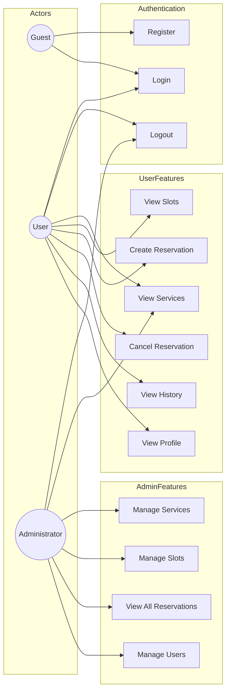
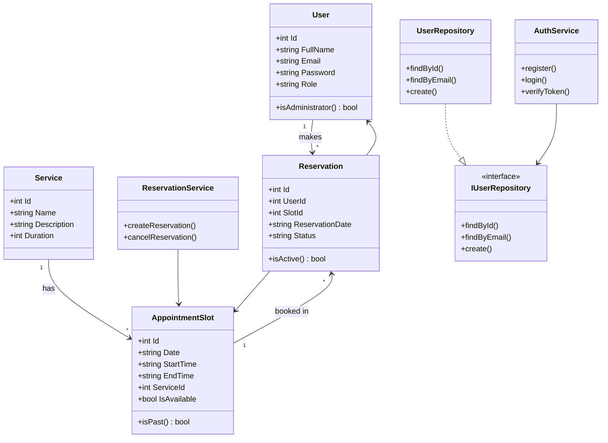
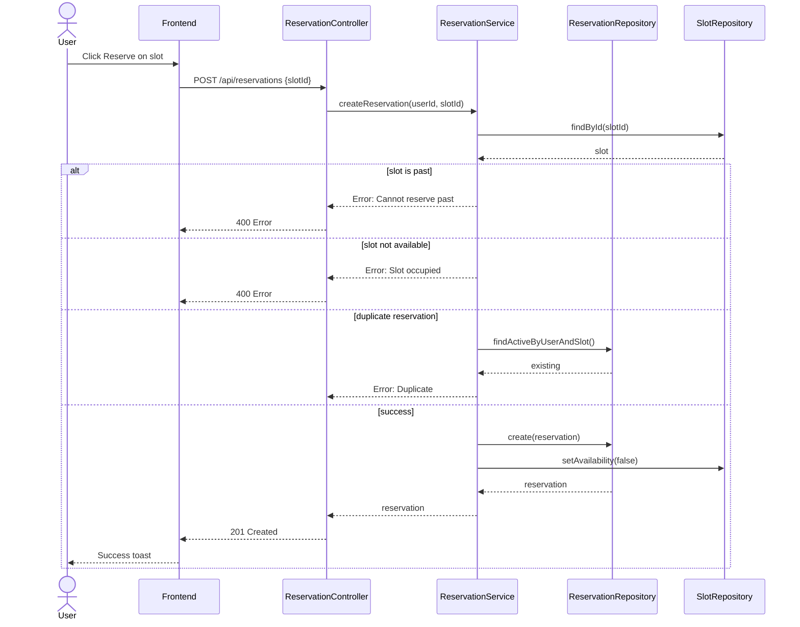
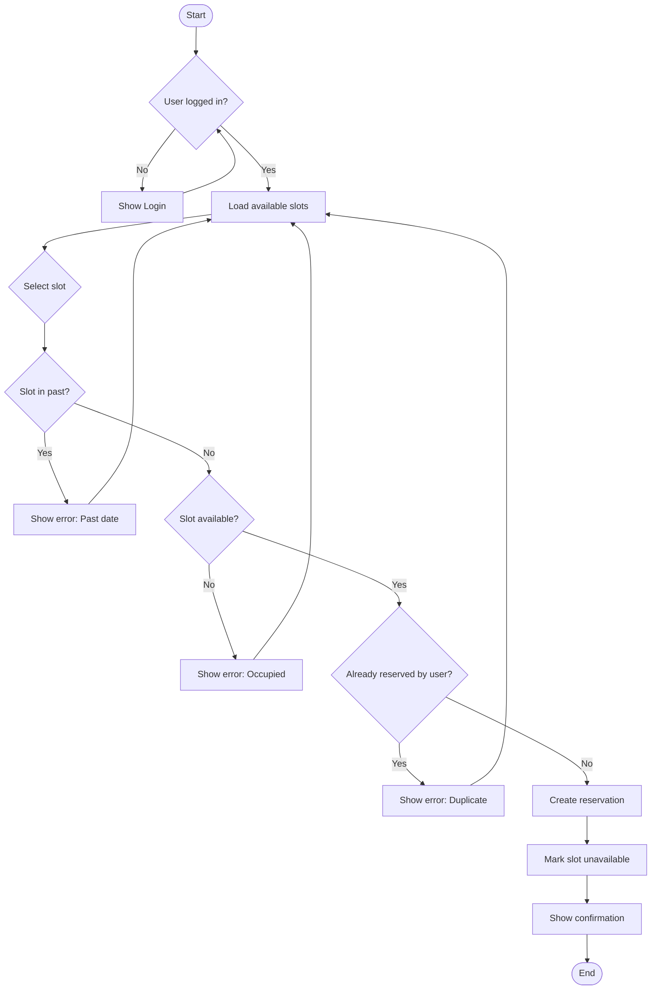

# UML Diagrams (Mermaid) — Appointment Reservation System

## Use Case Diagram

```mermaid
flowchart LR
    subgraph Actors
        Guest((Guest))
        User((User))
        Admin((Administrator))
    end

    subgraph Authentication
        UC1[Register]
        UC2[Login]
        UC3[Logout]
    end

    subgraph UserFeatures
        UC4[View Services]
        UC5[View Slots]
        UC6[Create Reservation]
        UC7[Cancel Reservation]
        UC8[View History]
        UC9[View Profile]
    end

    subgraph AdminFeatures
        UC10[Manage Services]
        UC11[Manage Slots]
        UC12[View All Reservations]
        UC13[Manage Users]
    end

    Guest --> UC1
    Guest --> UC2
    User --> UC2
    User --> UC3
    User --> UC4
    User --> UC5
    User --> UC6
    User --> UC7
    User --> UC8
    User --> UC9
    Admin --> UC3
    Admin --> UC4
    Admin --> UC10
    Admin --> UC11
    Admin --> UC12
    Admin --> UC13
```

## Class Diagram

```mermaid
classDiagram
    class User {
        +int Id
        +string FullName
        +string Email
        +string Password
        +string Role
        +isAdministrator() bool
    }

    class Service {
        +int Id
        +string Name
        +string Description
        +int Duration
    }

    class AppointmentSlot {
        +int Id
        +string Date
        +string StartTime
        +string EndTime
        +int ServiceId
        +bool IsAvailable
        +isPast() bool
    }

    class Reservation {
        +int Id
        +int UserId
        +int SlotId
        +string ReservationDate
        +string Status
        +isActive() bool
    }

    class AuthService {
        +register()
        +login()
        +verifyToken()
    }

    class ReservationService {
        +createReservation()
        +cancelReservation()
    }

    class IUserRepository {
        <<interface>>
        +findById()
        +findByEmail()
        +create()
    }

    class UserRepository {
        +findById()
        +findByEmail()
        +create()
    }

    Service "1" --> "*" AppointmentSlot : has
    User "1" --> "*" Reservation : makes
    AppointmentSlot "1" --> "*" Reservation : booked in
    UserRepository ..|> IUserRepository
    AuthService --> IUserRepository
    ReservationService --> AppointmentSlot
    Reservation --> AppointmentSlot
    Reservation --> User
```

## Sequence Diagram — Create Reservation

```mermaid
sequenceDiagram
    actor U as User
    participant UI as Frontend
    participant API as ReservationController
    participant SVC as ReservationService
    participant RR as ReservationRepository
    participant SR as SlotRepository

    U->>UI: Click Reserve on slot
    UI->>API: POST /api/reservations {slotId}
    API->>SVC: createReservation(userId, slotId)
    SVC->>SR: findById(slotId)
    SR-->>SVC: slot

    alt slot is past
        SVC-->>API: Error: Cannot reserve past
        API-->>UI: 400 Error
    else slot not available
        SVC-->>API: Error: Slot occupied
        API-->>UI: 400 Error
    else duplicate reservation
        SVC->>RR: findActiveByUserAndSlot()
        RR-->>SVC: existing
        SVC-->>API: Error: Duplicate
    else success
        SVC->>RR: create(reservation)
        SVC->>SR: setAvailability(false)
        RR-->>SVC: reservation
        SVC-->>API: reservation
        API-->>UI: 201 Created
        UI-->>U: Success toast
    end
```

## Activity Diagram — Appointment Booking Flow

```mermaid
flowchart TD
    A([Start]) --> B{User logged in?}
    B -->|No| C[Show Login]
    C --> B
    B -->|Yes| D[Load available slots]
    D --> E{Select slot}
    E --> F{Slot in past?}
    F -->|Yes| G[Show error: Past date]
    G --> D
    F -->|No| H{Slot available?}
    H -->|No| I[Show error: Occupied]
    I --> D
    H -->|Yes| J{Already reserved by user?}
    J -->|Yes| K[Show error: Duplicate]
    K --> D
    J -->|No| L[Create reservation]
    L --> M[Mark slot unavailable]
    M --> N[Show confirmation]
    N --> O([End])
```
